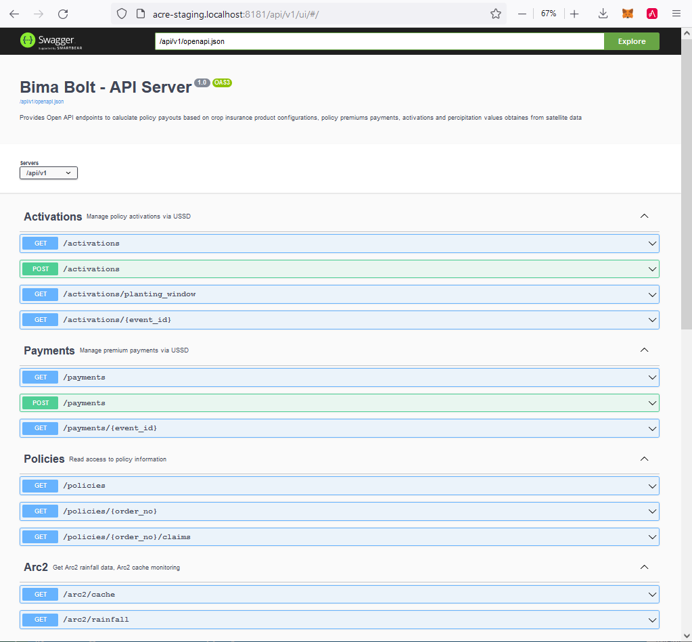

# Bima Bolt API

A generic API for crop microinsurance backend based on rainfall index.

## Overview

The API covers the following main entities

* Activations
* Premium payments
* Policies
* Rainfall data
* Admin/config

## API specification

OpenAPI/Swagger is used to specify the Bima Bolt API.
The specification document is represented by file `bima_bolt.yaml` in this repository.

In addition to the REST endpoints a graphical interface UI is provided in the form of a simple web application.
The screenshot below shows the current implementation of the API.



### Start API server dependencies

Before you build/start the api server make sure to start up its dependencies. 

In some other terminal start the following containers

* mongodb
* minio
* arc2 server

The three dependencies may be started using the `docker-compose.yml` file in docker-env
in your local repository cd into the `docker-env` directory.

```bash
cd docker-env
docker-compose up -d
cd ..
```

Verify the three running containers using `docker-compose ps`

```bash
docker-compose ps
 Name                Command               State                     Ports
---------------------------------------------------------------------------------------------
arc2      flask run --host 0.0.0.0         Up      0.0.0.0:5000->5000/tcp,:::5000->5000/tcp
minio     /usr/bin/docker-entrypoint ...   Up      0.0.0.0:9000->9000/tcp,:::9000->9000/tcp
mongodb   docker-entrypoint.sh mongod      Up      0.0.0.0:3101->27017/tcp,:::3101->27017/tcp
```

### Test API server dependencies

Check container using app "MongoDB Compass"

* host: localhost
* port: 3101

Check the minio service in the browser `http://127.0.0.1:9000/minio/`

Check container using curl 

```bash
curl -X GET "http://127.0.0.1:5000/arc2/rainfall?lat=-0.9&long=37.7&date=20200201&days=7"
```

Expected output

```bash
20200201 19.597993850708008
20200202 0.0
20200203 1.1990208625793457
20200204 0.31660813093185425
20200205 0.40143030881881714
20200206 1.095880150794983
20200207 0.0
```

## Setup @ windows box/wsl2

Rebuild generateed code after changes to `bima_bolt.yaml`

```bash
docker run --rm -v "${PWD}:/local" openapitools/openapi-generator-cli generate \
-i /local/bima_bolt.yaml \
-t /local/codegen/templates \
-g python-flask \
-o /local/src-gen
```

Rebuild docker image (after any changes affecting the image)

```bash
docker build -t bima_bolt .
```

### Run API server 

```bash
docker run -p 8181:8181 -e DB_HOST=host.docker.internal -e DB_PORT=3101 -e DB_NAME=bima_bolt bima_bolt
```

Work with the api server in the browser
`http://acre-staging.localhost:8181/api/v1/ui/#`

### Test setup

```json
{
  "arc2": {
    "host": "host.docker.internal",
    "port": 5000,
    "resource": "arc2/rainfall",
    "timeout": 5000
  },
  "mongo": {
    "host": "host.docker.internal",
    "port": 3101,
    "resource": "systemtest",
    "timeout": 1000
  },
  "s3": {
    "access_id": "chante to your access key",
    "access_secret": "change to your secret key",
    "host": "host.docker.internal",
    "port": 9000,
    "resource": "systemtest",
    "timeout": 1000
  }
}
```

# Setup @ linux (delta to wsl2 setup)

```json
{
  "arc2": {
    "host": "localhost",
    "port": 5000,
    "resource": "arc2/rainfall",
    "timeout": 5000
  },
  "mongo": {
    "host": "localhost",
    "port": 3101,
    "resource": "systemtest",
    "timeout": 1000
  },
  "s3": {
    "access_id": "chante to your access key",
    "access_secret": "chante to your secret key",
    "host": "localhost",
    "port": 9000,
    "resource": "systemtest",
    "timeout": 1000
  }
}
```
